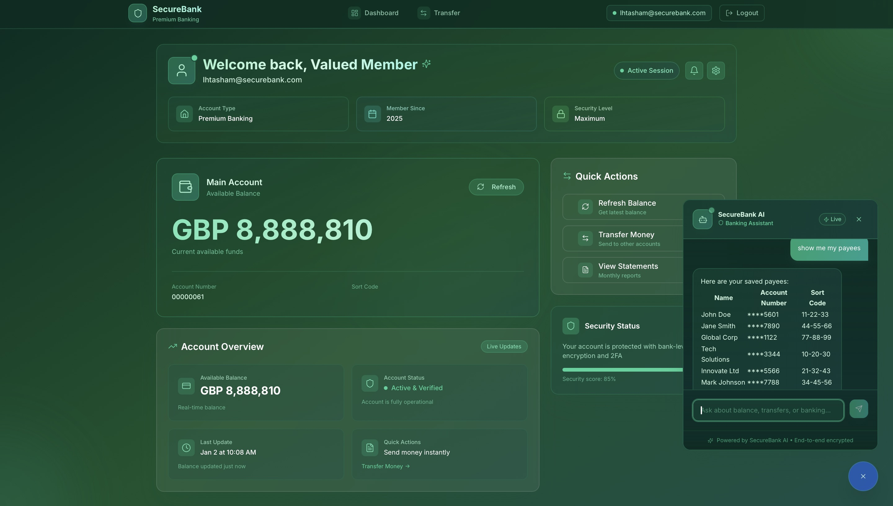

# 🏦 SECUREBANK – AI-Powered Digital Banking Platform
 
[](LICENSE)
[](https://www.python.org/)
[](https://fastapi.tiangolo.com/)
[](https://reactjs.com/)
[](https://www.docker.com/)
[](https://cloud.oracle.com/)
 
> A production-grade, full-stack banking platform with an integrated conversational AI agent — built from a blank cloud server into a fully functional, intelligent financial system.
 

 
---
 
## 🚀 Overview
 
SECUREBANK is an AI-enabled digital banking platform that combines core banking functionality with an intelligent, grounded AI assistant. Users interact with their accounts through a modern React interface while the AI agent — powered by Google Gemini — can answer questions, check balances, and initiate transfers using live account data.
 
The platform is fully containerised, deployed on Oracle Cloud Infrastructure, and ships with a zero-touch CI/CD pipeline that goes from `git push` to live in under a minute.
 
---
 
## ✨ Features
 
### 💰 Core Banking
- Secure authentication with JWT-based authorisation
- Interactive dashboard with real-time account balances
- Transaction management — view, filter, and transfer funds
- Responsive UI built with React and TypeScript
### 🧠 AI Banking Assistant
- Conversational interface powered by Google Gemini and ADK
- **Grounded responses** — the AI only uses live data from your accounts, never fabricates
- **Action-oriented** — can check balances and initiate transfers with explicit user confirmation
- Secure MCP tool integration for all backend actions
### 🛠️ DevOps & Infrastructure
- Zero-touch CI/CD — auto-deploys on every push in **< 1 minute**
- Full containerisation with Docker and Docker Compose
- Nginx reverse proxy for routing, security, and load balancing
- Deployed on Oracle Cloud Infrastructure (OCI)
---
 
## 🏗️ Architecture
 
```
┌─────────────────────────────────────────────────────────────┐
│                      🌐 CLIENT BROWSER                       │
└─────────────────────────┬───────────────────────────────────┘
                          │ HTTPS
                          ▼
┌─────────────────────────────────────────────────────────────┐
│                   🚪 NGINX REVERSE PROXY                     │
└──────────────┬──────────────────────────────┬───────────────┘
               │ API Calls                    │ Static Files
               ▼                              ▼
┌─────────────────────────┐    ┌──────────────────────────────┐
│   🐍 FASTAPI BACKEND    │    │    ⚛️  REACT FRONTEND         │
│  • Business Logic       │    │  • User Interface            │
│  • Auth & Sessions      │    │  • State Management          │
│  • API Routes           │    │  • Real-time Updates         │
└──────────────┬──────────┘    └──────────────────────────────┘
               │
       ┌───────┴────────┐
       ▼                ▼
┌─────────────────┐  ┌────────────────────┐
│ 🧠 AI AGENT     │  │ ☁️  ORACLE CLOUD    │
│ (Google ADK)    │  │ Autonomous Database │
│ • Gemini LLM    │  │ • Persistent Storage│
│ • MCP Tools     │  │ • High Availability │
│ • Grounded Prompts│ └────────────────────┘
└─────────────────┘
```
 
---
 
## 🔄 CI/CD Pipeline
 
Every push to `main` triggers a fully automated pipeline:
 
```
git push → GitHub Actions → Build & Test → Docker Image → Oracle Cloud → Live
```
 
Steps include code validation, dependency installation, linting, automated testing, Docker image creation, and zero-touch deployment. The entire process completes in **under one minute** with no manual intervention required.
 
---
 
## 🤖 The AI Agent
 
This isn't a generic chatbot. The agent operates under strict, bank-grade rules:
 
| Principle | Detail |
| :--- | :--- |
| **Grounded** | Only answers using live data from the Oracle database — never guesses |
| **Action-oriented** | Performs tasks (balance checks, transfers) via secure MCP tools |
| **Safety-first** | Requires explicit user confirmation before moving any money |
| **Conversational** | Understands natural language — *"What did I spend last week?"* |
 
---
 
## 🛠️ Technology Stack
 
| Layer | Technologies |
| :--- | :--- |
| **Frontend** | React 18, TypeScript, HTML5, CSS3 |
| **Backend** | Python 3.12, FastAPI, Uvicorn, Pydantic |
| **AI & LLM** | Google ADK, Gemini, MCP |
| **Database** | Oracle Autonomous Database, SQL |
| **Infrastructure** | Docker, Docker Compose, Nginx, OCI Compute |
| **DevOps** | GitHub Actions, CI/CD, Automated Testing |
| **Security** | JWT, HTTPS, Environment Isolation, Reverse Proxy |
 
---
 
## 📂 Project Structure
 
```
BANK/
├── frontend/        # React + TypeScript UI
│   ├── src/
│   └── public/
├── backend/         # FastAPI application
│   ├── routers/
│   ├── models/
│   └── services/
├── agents/          # Google ADK agents & MCP tools
├── database/        # SQL scripts & Oracle config
├── nginx/           # Reverse proxy configuration
├── docker/          # Dockerfiles & Compose specs
├── .github/         # CI/CD workflows
└── docs/            # Documentation & screenshots
```
 
---
 
## 🚀 Getting Started
 
### Prerequisites
- Python 3.12+
- Docker & Docker Compose
- Oracle Database access
- Google AI API Key
### Run Locally
 
```bash
git clone https://github.com/ihtali/BANK.git
cd BANK
docker-compose up --build
```
 
### Access Points
 
| Service | URL |
| :--- | :--- |
| **Frontend** | `http://localhost` |
| **Backend API** | `http://localhost/api` |
| **API Docs** | `http://localhost/docs` |
 
---
 
## 🔒 Security
 
- JWT authentication and session management
- HTTPS enforced via Nginx reverse proxy
- Database credentials isolated via environment variables
- Containerised services with no direct external exposure
- Input validation throughout the API layer
- Defence-in-depth architecture
---
 
## 🔮 Roadmap
 
- [ ] Multi-agent workflows (fraud detection + customer service)
- [ ] Voice banking assistant
- [ ] Real-time notifications via WebSockets
- [ ] Advanced analytics dashboard with AI-generated insights
- [ ] Role-based access control (Admin, Teller, Customer)
---
 
## 👨‍💻 About
 
Built end-to-end by **Ihtasham Ali** — from blank cloud instance to live production system.
 
Responsibilities covered: frontend (React/TypeScript), backend (FastAPI), AI agent integration (Google ADK + Gemini), MCP tool implementation, database design (Oracle), Docker containerisation, Nginx configuration, cloud deployment (OCI), and CI/CD automation (GitHub Actions).
 
[](https://www.linkedin.com/in/ihtasham-ali-7aa659240/)
[](https://github.com/ihtali)
 
---
