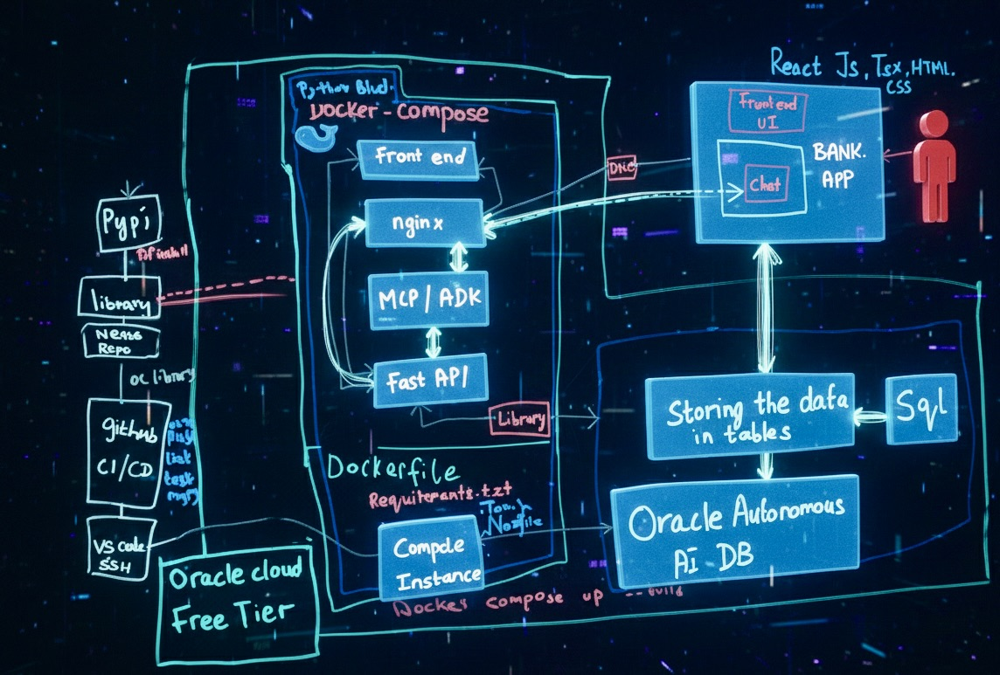
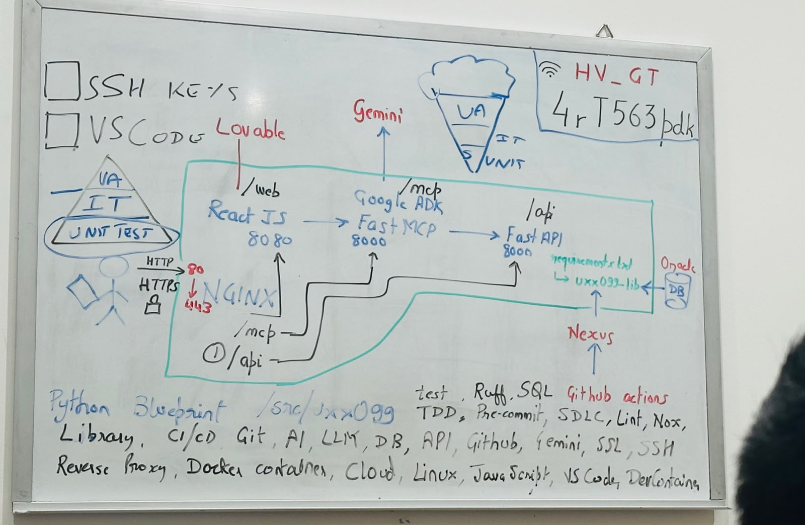

# 🏦 BANK – AI-Powered Banking Platform

A full-stack banking platform built from the ground up using modern cloud-native architecture, AI agents, containerization, Oracle Cloud infrastructure, and enterprise-grade deployment practices.

This project demonstrates end-to-end ownership across frontend development, backend services, AI integration, database design, cloud infrastructure, DevOps, CI/CD, and deployment automation.

---

## 🚀 Project Overview

BANK is an AI-enabled digital banking platform that combines traditional banking functionality with intelligent customer assistance.

The system allows users to interact with banking services through a modern web interface while leveraging AI-powered agents to provide customer support, answer banking questions, and assist with user workflows.

The platform is designed using a microservice-friendly architecture and deployed using Docker containers on Oracle Cloud Infrastructure.

---

## ✨ Features

### Banking Features

- User authentication and authorization
- Secure account management
- Banking dashboard
- Transaction management
- Customer account information
- Real-time data retrieval
- Secure API communication

### AI Features

- AI-powered banking assistant
- Intelligent customer support
- Context-aware conversations
- MCP-based tool integration
- Google ADK agent orchestration
- Gemini-powered responses
- Banking workflow assistance

### Engineering Features

- Full Dockerized deployment
- Nginx reverse proxy
- FastAPI backend services
- Oracle Autonomous Database integration
- GitHub Actions CI/CD
- Automated testing pipeline
- Cloud deployment automation
- Production-ready architecture

---

# 🏗 Architecture

```text
┌────────────────────────────┐
│        React Frontend      │
│    TypeScript + HTML/CSS   │
└─────────────┬──────────────┘
              │
              ▼
┌────────────────────────────┐
│           Nginx            │
│      Reverse Proxy         │
└─────────────┬──────────────┘
              │
      ┌───────┴────────┐
      ▼                ▼

┌─────────────┐  ┌─────────────┐
│  FastAPI    │  │ MCP / ADK   │
│   Backend   │  │ AI Layer    │
└──────┬──────┘  └──────┬──────┘
       │                │
       └────────┬───────┘
                ▼

┌────────────────────────────┐
│ Oracle Autonomous Database │
│      Persistent Storage    │
└────────────────────────────┘
```

---

# 🛠 Technology Stack

## Frontend

- React
- TypeScript
- HTML5
- CSS3

## Backend

- Python 3.12
- FastAPI
- Uvicorn
- Pydantic

## AI Layer

- Google Agent Development Kit (ADK)
- Gemini Models
- MCP (Model Context Protocol)
- AI Tool Integration

## Database

- Oracle Autonomous Database
- SQL
- Relational Data Modeling

## Infrastructure

- Docker
- Docker Compose
- Nginx
- Oracle Cloud Infrastructure (OCI)

## DevOps

- GitHub Actions
- CI/CD Pipelines
- Automated Testing
- Linting
- Deployment Automation

---

# ☁ Cloud Deployment

The application is deployed on Oracle Cloud Infrastructure using a containerized architecture.

Deployment stack:

- Oracle Cloud Compute Instance
- Docker Engine
- Docker Compose
- Nginx Reverse Proxy
- Oracle Autonomous Database
- GitHub Actions Automation

Deployment flow:

```text
Developer
   │
   ▼
GitHub Repository
   │
   ▼
GitHub Actions
   │
   ▼
Build + Test
   │
   ▼
Docker Image
   │
   ▼
Oracle Cloud VM
   │
   ▼
Docker Compose Deployment
```

---

# 🔄 CI/CD Pipeline

Automated pipeline includes:

- Code validation
- Dependency installation
- Linting
- Testing
- Build verification
- Docker image creation
- Deployment preparation

Benefits:

- Consistent deployments
- Reduced manual errors
- Faster delivery cycle
- Improved reliability

---

# 🤖 AI Banking Assistant

The platform integrates an intelligent banking assistant capable of:

- Answering customer questions
- Assisting users with banking workflows
- Providing contextual banking information
- Accessing backend tools through MCP
- Improving customer experience through AI-powered interactions

---

# 🔒 Security Considerations

Implemented security practices include:

- Secure API architecture
- Environment-based configuration
- Database credential isolation
- Containerized services
- Reverse proxy protection
- Authentication controls
- Input validation

---

# 📂 Project Structure

```text
BANK/
│
├── frontend/
│   ├── React UI
│   └── TypeScript Components
│
├── backend/
│   ├── FastAPI Services
│   ├── Business Logic
│   └── API Routes
│
├── agents/
│   ├── Google ADK Agents
│   └── MCP Integrations
│
├── database/
│   ├── SQL Scripts
│   └── Oracle Configuration
│
├── nginx/
│   └── Reverse Proxy Configuration
│
├── docker/
│   └── Container Definitions
│
├── .github/
│   └── GitHub Actions Workflows
│
└── docs/
```

---

# 🚀 Running Locally

## Prerequisites

- Python 3.12+
- Docker
- Docker Compose
- Oracle Database Access
- Google AI API Key

## Clone Repository

```bash
git clone https://github.com/ihtali/BANK.git

cd BANK
```

## Start Services

```bash
docker-compose up --build
```

## Access Application

```text
Frontend:
http://localhost

Backend:
http://localhost/api

API Docs:
http://localhost/docs
```

---

# 📸 Screenshots

## Login Page



## Banking Dashboard



## Transaction Management

Add screenshot here

## AI Assistant

Add screenshot here

---

# 🎯 Key Learning Outcomes

This project provided hands-on experience in:

- Full-stack application development
- Enterprise API design
- AI agent integration
- Oracle Cloud deployment
- Container orchestration
- CI/CD automation
- Database architecture
- Production infrastructure management
- Secure software engineering

---

# 👨‍💻 My Contribution

This project was independently designed and developed end-to-end, including:

- Frontend development
- Backend architecture
- API implementation
- Database integration
- AI agent integration
- MCP implementation
- Docker containerization
- Nginx configuration
- Cloud deployment
- CI/CD automation
- Testing and debugging
- Infrastructure management

---

# 🔮 Future Enhancements

- Multi-agent banking workflows
- Voice banking assistant
- Advanced fraud detection
- Real-time notifications
- Enhanced analytics dashboard
- Role-based administration
- AI-powered financial insights

---

## 📬 Contact

**Ihtasham Ali**

LinkedIn:
https://www.linkedin.com/in/ihtasham-ali-7aa659240/

GitHub:
https://github.com/ihtali

---
⭐ If you found this project interesting, feel free to star the repository.
